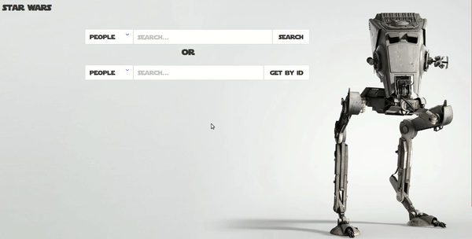

[Ссылка на PAGES](https://kiirrusha.github.io/Async-Await/)

# STAR WARS

## Введение
Как вы относитесь к Звездным Войнам? Давайте сделаем сайтик, который будет выдавать нам всю информацию о персонажах, планетах, и видах которые присутствовали в этой киноэпопее. Конечно же, вы пока не умеете получать данные со сторонних сервисов, поэтому мы написали небольшой модуль, который даст вам возможность запрашивать нужную вам информацию. Всё что вам для этого потребуется - умение работать с `Promise, then().catch(), async/await`.

## Releases

### Release 0. Init

За вас уже выполнена часть проекта. Изучите всё, что вам предоставили. 

- В папке `fonts` лежит шрифт из фильма; 
- в папке `images` - различные картинки, которые можете использовать, чтобы кастомизировать сайт на свой вкус; 
- в папке `lib` лежит файл `star-wars.js`, в котором предоставлены готовые методы, для получения информации о Звездных Войнах (**вам необязательно разбираться, как работает код в данном модуле, просто пользуйтесь методами**);
- в папке `scripts` лежит пустой скрипт, который вам предстоит наполнить;
- в папке `stylesheets` - стили проекта.

### Release 1. CharacterByQuery

Разобрались? Начнём. Добавьте поле ввода на страницу. Сделайте так, чтобы в это поле можно было ввести запрос, по которому вы хотите искать, нажать на кнопку "search", а в результате увидеть данные по запросу в специальном блоке ниже. Давайте пока ограничимся запросом на поиск персонажей. Хотелось бы увидеть что-то такое:

### Release 2. +PlanetName

Отличная работа! Смотрите, нам приходит объект нужного персонажа, и у него есть поле `homeworld`, в котором можно заметить `id` планеты. Давайте сделаем так, чтобы вместо `id` выводилось название планеты! Вам предстоит снова воспользоваться одним из предоставленных модулем `lib/star-wars.js` методов. На этот раз вам надо 
- получить персонажа, 
- потом вытащить `id` его планеты, 
- получить данные о планете,
- вытащить имя планеты,
- в изначальных данных о персонаже заменить ссылку на планету на её наименование.

Готово! Должно получиться примерно так:

### Release 3. Select resource

Продолжим совершенствовать наш поисковик. Добавьте возможность выбирать ресурс по которому хотите искать: люди, планеты, виды. Соответственно, когда вы выбираете ресурс, вводите запрос, то будет вызываться один из трёх заготовленных для вас методов (поиск по персонажам, по планетам, по видам). Выглядеть это будет так:

### Release 4. getById

Прекрасно, теперь добавим еще одно поле для поиска. Это будет поле для поиска по `id`. Тут также стоит добавить селект, чтобы можно было выбирать ресурс, по которому поиск должен осуществляться. И снова вам помогут методы модуля `star-wars.js`, которые как обычно возвращают промисы.
Вот результат:

## Заключение
Вы поработали с промисами, научились делать цепочки из промисов, познакомились с css-фреймворком Bulma, а также, незаметно для себя, столкнулись с http-запросами и тем как они разрешаются с помощью async-await синтаксиса! Поздравляем с успешно выполненным заданием!
